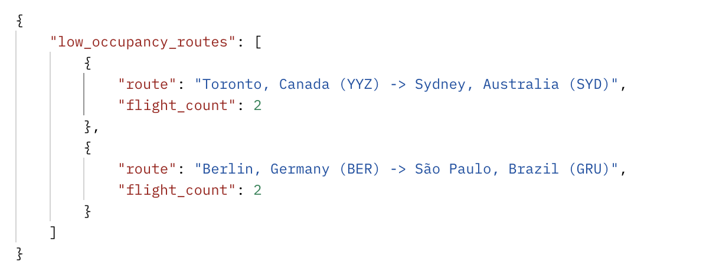

#  Реализация серверной части приложения средствами django и djangorestframework в соответствии с заданием из текста работы.

## Описание моего варианта

### Задание 14
Создать программную систему, предназначенную для администрации аэропорта
некоторой компании-авиаперевозчика.
Рейсы обслуживаются бортами, принадлежащими разным авиаперевозчикам. О
каждом самолете необходима следующая минимальная информация: номер самолета, тип,
число мест, скорость полета, компания-авиаперевозчик. Один тип самолета может летать
на разных маршрутах и по одному маршруту могут летать разные типы самолетов.
О каждом рейсе необходима следующая информация: номер рейса, расстояние до
пункта назначения, пункт вылета, пункт назначения; дата и время вылета, дата и время

17
прилета, транзитные посадки (если есть), пункты посадки, дата и время транзитных
посадок и дат и время их вылета, количество проданных билетов. Каждый рейс
обслуживается определенным экипажем, в состав которого входят командир корабля,
второй пилот, штурман и стюардессы или стюарды. Каждый экипаж может обслуживать
разные рейсы на разных самолетах. Необходимо предусмотреть наличие информации о
допуске члена экипажа к рейсу.
Администрация компании-владельца аэропорта должна иметь возможность
принять работника на работу или уволить. При этом необходима следующая информация:
ФИО, возраст, образование, стаж работы, паспортные данные. Эта же информация
необходима для сотрудников сторонних компаний.
Перечень возможных запросов:
 Выбрать марку самолета, которая чаще всего летает по маршруту.
 Выбрать маршрут/маршруты, по которым летают рейсы, заполненные менее чем на
ХХ %.
 Определить наличие свободных мест на заданный рейс.
 Определить количество самолетов, находящихся в ремонте.
 Определить количество работников компания-авиаперевозчика.
## Стек реализации

- Язык: Python
- фреймворк : Django, DRF

## serializers
```python
class CrewSerializer(serializers.ModelSerializer):
    captain = CrewMemberSerializer(read_only=True)
    co_pilot = CrewMemberSerializer(read_only=True)
    navigator = CrewMemberSerializer(read_only=True)
    attendants = CrewMemberSerializer(many=True, read_only=True)

    class Meta:
        model = Crew
        fields = '__all__'


class RouteSerializer(serializers.ModelSerializer):
    departure_airport = AirportSerializer(read_only=True)
    destination_airport = AirportSerializer(read_only=True)
    stops = AirportSerializer(many=True, read_only=True)

    class Meta:
        model = Route
        fields = '__all__'


class FlightSerializer(serializers.ModelSerializer):
    crew = CrewSerializer(read_only=True)
    route = RouteSerializer(read_only=True)
    plane = PlaneSerializer(read_only=True)

    class Meta:
        model = Flight
        fields = '__all__'

```
Описание
rewSerializer (Сериализатор экипажа):

Этот сериализатор используется для преобразования данных о Crew (экипаже) в удобный формат (например, JSON).
В нем есть четыре поля:
captain (капитан) — сериализатор для описания данных о капитане, использующий CrewMemberSerializer.
co_pilot (второй пилот) — аналогично, сериализатор для второго пилота.
navigator (навигационная роль) — сериализатор для данных о навигаторе.
attendants (стюардессы) — сериализатор для списка стюардесс, которые могут быть в экипаже.
В Meta классе указано, что этот сериализатор работает с моделью Crew, и возвращает все поля модели.
RouteSerializer (Сериализатор маршрута):

Этот сериализатор используется для работы с моделью Route (маршрут).
Он включает в себя:
departure_airport (аэропорт отправления) — сериализатор, который преобразует данные о Airport (аэропорте отправления) с помощью AirportSerializer.
destination_airport (аэропорт назначения) — аналогичный сериализатор для аэропорта назначения.
stops (остановки) — список аэропортов, через которые будет проходить рейс (транзитные аэропорты).
В Meta классе указано, что сериализатор работает с моделью Route и выводит все поля этой модели.
FlightSerializer (Сериализатор рейса):

Этот сериализатор используется для преобразования данных о Flight (рейсе).
Включает:
crew (экипаж) — сериализатор для данных о экипаже с использованием CrewSerializer.
route (маршрут) — сериализатор для данных о маршруте рейса с использованием RouteSerializer.
plane (самолет) — сериализатор для данных о самолете, используя PlaneSerializer.
В Meta классе указано, что сериализатор работает с моделью Flight и возвращает все поля этой модели.

## Примеры запросов
```python
http://127.0.0.1:8000/api/airlines/
выводит
[
  {
    "id": 1,
    "name": "Skyline Airways",
    "address": "123 Main St, New York, NY",
    "contact_info": "+123456789"
  },
  {
    "id": 2,
    "name": "Oceanic Airlines",
    "address": "456 Ocean Ave, Miami, FL",
    "contact_info": "+987654321"
  },
]

http://127.0.0.1:8000/api/airports/
выводит
[
  {
    "id": 1,
    "country": "USA",
    "city": "New York",
    "code": "JFK",
    "contact_info": "info@jfk.com"
  },
]
```
## Authentication
```python
метод POST
создания пользователя 
http://127.0.0.1:8000/api/auth/users/

Метод POST
Получение токена
http://127.0.0.1:8000/api/auth/token/login
пример токена:
{
    "auth_token": "299eb6516e1728fb24cc74538d1a9f6f015df7a5"
}

Метов GET
Получение пользователя по токену
http://127.0.0.1:8000/api/auth/users/me/

```

## Аналитические запросы
1. Выбрать марку самолета, которая чаще всего летает по маршруту.

Запрос  http://localhost:8000/api/analytics/most-frequent-plane/


2. Выбрать маршрут/маршруты, по которым летают рейсы, заполненные менее чем на
ХХ %.

Запрос http://localhost:8000/api/analytics/low-occupancy-routes/59/



3. Определить наличие свободных мест на заданный рейс.

Запрос http://localhost:8000/api/analytics/check-free-seats/1/


4. Определить количество самолетов, находящихся в ремонте.

Запрос http://localhost:8000/api/analytics/planes-in-maintenance/


5. Определить количество работников компания-авиаперевозчика.

Запрос http://localhost:8000/api/analytics/company-employees-count/2/


